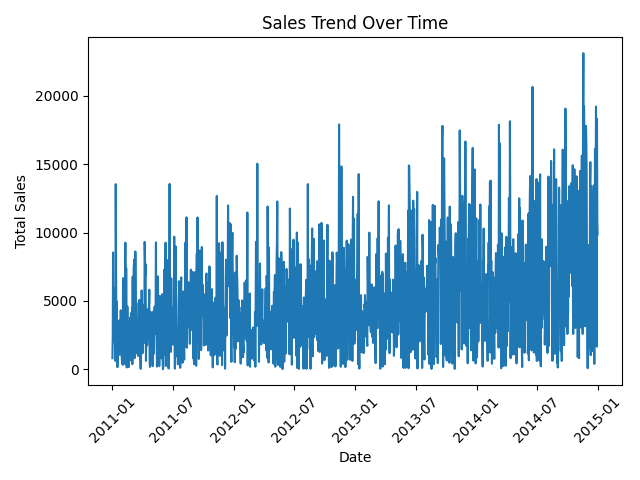
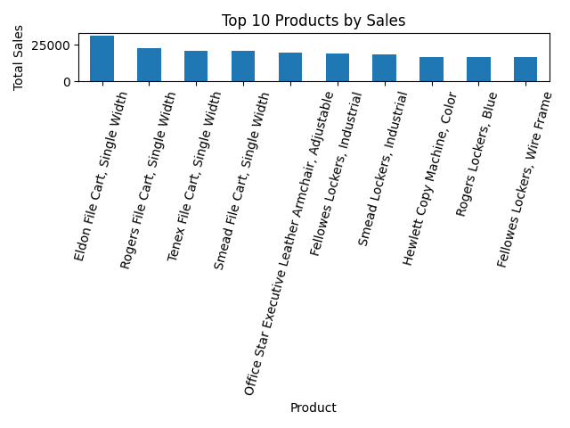
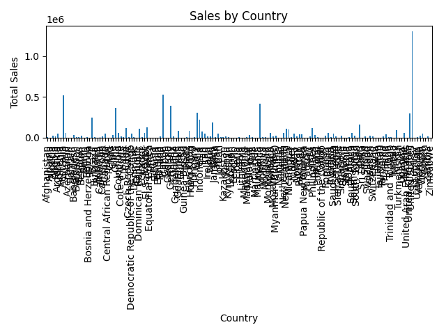
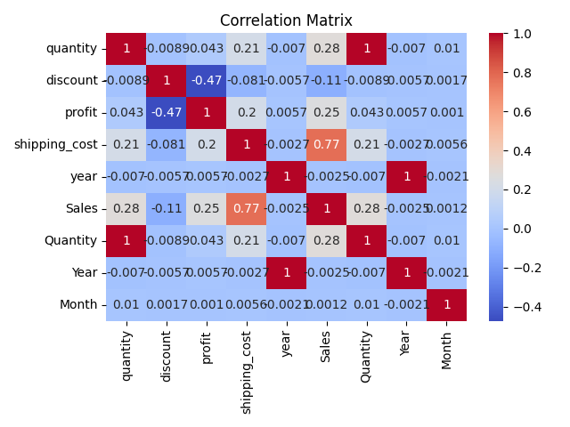
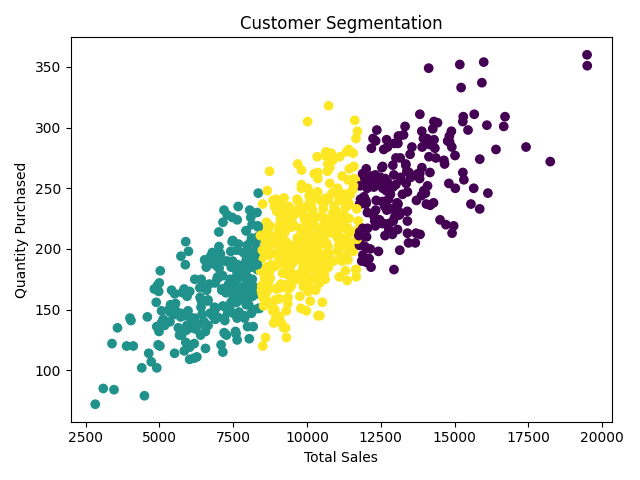

# Sales Data Analysis Project using Python

## 🚀 نظرة عامة على المشروع

هذا المشروع يعرض تحليل بيانات مبيعات حقيقي باستخدام Python. يتم فيه تنظيف البيانات، إجراء تحليل استكشافي، وتقسيم العملاء باستخدام خوارزمية K-Means.

الهدف من المشروع هو استخراج رؤى مهمة حول:

- 📦 أداء المنتجات
- 🌍 توزيع المبيعات حسب البلد
- 👥 سلوك العملاء

## 📁 بنية المشروع

```text
TP3_Sales_Project
│
├── data
│   └── SuperStoreOrders.csv
│
├── output
│   ├── cleaned_data.csv
│   └── figures
│       ├── figure_1_sales_trend.png
│       ├── figure_2_top_products.png
│       ├── figure_3_country_sales.png
│       ├── figure_4_heatmap.png
│       └── figure_5_customer_clusters.png
│
├── src
│   ├── cleaning.py
│   ├── analysis.py
│   └── main.py
│
├── requirements.txt
└── README.md
```

## 📦 وصف مجموعة البيانات

البيانات موجودة في `data/SuperStoreOrders.csv` وتحتوي على سجلات معاملات المبيعات.

تشمل الأعمدة الأساسية:

- 📅 `order_date`: تاريخ المعاملة
- 🚚 `ship_date`: تاريخ الشحن
- 🧍‍♂️ `customer_name`: اسم العميل
- 🌍 `country`: البلد
- 📦 `product_name`: وصف المنتج
- 💰 `sales`: قيمة المبيعات
- 🔢 `quantity`: الكمية المباعة
- 📉 `discount`: الخصم المطبق
- 📈 `profit`: الربح
- 🏷️ `category` / `sub_category`: تصنيف المنتج

## 🧹 تنظيف البيانات

يتم تنفيذ تنظيف البيانات في `src/cleaning.py` عبر Pandas.

العمليات التي تمت:

- ❌ حذف التكرارات
- 🚫 حذف الصفوف غير الصالحة أو المفقودة
- 📅 تحويل عمود `order_date` إلى نوع تاريخ
- 🔢 تحويل `sales` و `quantity` إلى قيم رقمية
- 🧾 إنشاء مجموعة بيانات نظيفة جاهزة للتحليل

الملف الناتج:

- `output/cleaned_data.csv`

## 🔎 التحليل الاستكشافي للبيانات (EDA)

يتم تنفيذ التحليل الاستكشافي في `src/analysis.py`.

التحليلات الناتجة تشمل:

- 📈 اتجاه المبيعات بمرور الوقت
- 🥇 أفضل 10 منتجات حسب المبيعات
- 🌍 المبيعات حسب البلد
- 🔗 خريطة الارتباط للمتغيرات العددية

### الصور الناتجة









## 🤖 تقسيم العملاء

يستخدم المشروع خوارزمية K-Means في `src/analysis.py` لتقسيم العملاء بناءً على:

- إجمالي المبيعات لكل عميل
- إجمالي الكمية المشتراة

ينتج عن ذلك ثلاث مجموعات:

- 🟢 عملاء ذوي قيمة عالية
- 🟡 عملاء متوسطو القيمة
- 🔴 عملاء ذوو قيمة منخفضة



## 🛠 التقنيات المستخدمة

- 🐍 Python
- 🐼 Pandas
- 🔢 NumPy
- 📉 Matplotlib
- 🎨 Seaborn
- 🤖 Scikit-learn

## ▶️ طريقة التشغيل

1. تثبيت المتطلبات:

```bash
pip install -r requirements.txt
```

2. تشغيل السكربت الرئيسي:

```bash
python src/main.py
```

3. سيتم إنشاء البيانات النظيفة والصور في المجلد `output/`.

## � لوحة Power BI

يمكنك مشاهدة التقرير التفاعلي في Power BI عبر الرابط التالي:

https://app.powerbi.com/links/hicPspR_38?ctid=fa7e31a0-d802-442a-a11d-dd99271b08bb&pbi_source=linkShare&bookmarkGuid=4e4bbf70-42fd-464b-b042-bfa149a63549

## �📌 ملاحظات

- إذا تغير اسم الملف أو بنية البيانات، حدث المسار في `src/main.py`.
- استخدم `output/figures/` للاطلاع على الصور الناتجة.

## 👤 المؤلف

Hala Mohammed islam

